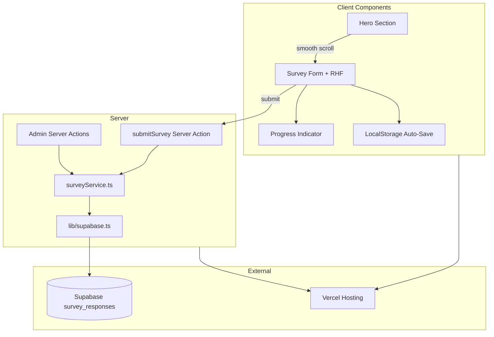

# Questionate — Step-by-Step Implementation Plan

This plan covers every requirement in [build-prompt.md](./build-prompt.md) for building the survey landing page.

---

## Phase 0 — Prerequisites & Decisions

Before writing code, lock these in:

| Item | Decision |
|------|----------|
| Node | 18+ (Next.js 15 requirement) |
| Package manager | `npm` (as specified in the prompt) |
| Auth for `/admin` | Simple password check via `ADMIN_PASSWORD` env var (no full auth system) |
| Supabase access | Server-only via `SUPABASE_SERVICE_ROLE_KEY` in Server Actions |
| Form state | Single React Hook Form instance for all 21 questions (20 numbered + final narrative) |

---

## Phase 1 — Project Scaffolding

### Step 1.1 — Initialize Next.js 15 app

```bash
npx create-next-app@latest questionate \
  --typescript \
  --tailwind \
  --eslint \
  --app \
  --src-dir=false \
  --import-alias "@/*"
```

Verify:

```bash
npm install
npm run dev
```

Runs without modifications.

### Step 1.2 — Install dependencies

```bash
npm install @supabase/supabase-js react-hook-form @hookform/resolvers zod lucide-react
npx shadcn@latest init
```

During shadcn init, pick:

- Style: Default or New York (either works; stay consistent)
- Base color: Slate (matches `#F8FAFC` background)
- CSS variables: Yes

### Step 1.3 — Add shadcn/ui components

Install only what you need:

```bash
npx shadcn@latest add button card input label textarea radio-group checkbox progress badge separator alert dialog
```

### Step 1.4 — Create folder structure

```text
app/
  page.tsx                    # Landing + survey
  layout.tsx                  # Root layout, metadata, fonts
  success/page.tsx            # Post-submit confirmation
  admin/
    page.tsx                  # Admin dashboard
    actions.ts                # Server actions for admin
  actions/
    survey.ts                 # Submit survey server action
components/
  ui/                         # shadcn components
  landing/
    hero-section.tsx
  survey/
    survey-form.tsx
    survey-section-card.tsx
    question-field.tsx
    progress-indicator.tsx
    restore-prompt-dialog.tsx
  admin/
    response-list.tsx
    response-detail.tsx
    stats-cards.tsx
    export-button.tsx
hooks/
  use-survey-autosave.ts
  use-survey-progress.ts
lib/
  supabase.ts                 # Server-side Supabase client
  constants.ts                # Colors, copy, section config
  survey-schema.ts            # Zod schema
  survey-questions.ts         # Question definitions (single source of truth)
services/
  surveyService.ts            # DB read/write helpers
types/
  survey.ts                   # TypeScript interfaces
utils/
  csv-export.ts
  local-storage.ts
public/
  favicon.ico
styles/
  globals.css                 # Tailwind + custom tokens
.env.local.example
README.md
```

### Step 1.5 — Configure design tokens in `globals.css`

Map the prompt palette:

- Primary: `#2563EB` → `--primary`
- Background: `#F8FAFC` → `--background`
- Cards: white → `--card`

Add:

- Smooth scrolling on `html`
- Subtle fade-in animation utility class
- Hover transition defaults on interactive elements

### Step 1.6 — Configure fonts (premium SaaS look)

In `app/layout.tsx`:

- Use `next/font` — e.g. Inter or Geist Sans
- Set `antialiased`, generous line-height, large whitespace defaults

---

## Phase 2 — Supabase Setup

### Step 2.1 — Create Supabase project

In Supabase dashboard:

1. New project
2. Copy URL, anon key, service role key

### Step 2.2 — Create `survey_responses` table

Run SQL migration:

```sql
create table survey_responses (
  id uuid primary key default gen_random_uuid(),
  created_at timestamptz not null default now(),
  answers jsonb not null
);

-- Optional: index for admin sorting/filtering
create index survey_responses_created_at_idx on survey_responses (created_at desc);

-- RLS: deny public access; server uses service role key
alter table survey_responses enable row level security;
```

No public insert policy — all writes go through Server Actions with the service role key.

### Step 2.3 — Environment variables

Create `.env.local.example`:

```env
NEXT_PUBLIC_SUPABASE_URL=
NEXT_PUBLIC_SUPABASE_ANON_KEY=
SUPABASE_SERVICE_ROLE_KEY=
ADMIN_PASSWORD=
```

Create `.env.local` locally with real values. Add `.env.local` to `.gitignore` (create-next-app usually does this).

---

## Phase 3 — Types & Data Layer

### Step 3.1 — Define survey types (`types/survey.ts`)

```typescript
// Core types
SurveyAnswers          // Full form payload
SurveyQuestion         // id, type, label, options, sectionId
SurveySection          // id, title, description, questionIds
SurveyResponseRecord   // { id, created_at, answers }
QuestionType           // 'radio' | 'checkbox' | 'textarea'
```

### Step 3.2 — Define all questions (`lib/survey-questions.ts`)

Single source of truth for all 21 questions across 5 sections + final question.

Structure each question:

```typescript
{
  id: 'q1',
  number: 1,
  sectionId: 'business-info',
  type: 'radio',
  label: 'What type of products do you sell?',
  options: ['Fashion & Clothing', 'Shoes', ...],
  hasOther: true,           // shows conditional textarea
  required: true,
}
```

**Complete question inventory (verify none are missed):**

| # | Section | Type | Other? |
|---|---------|------|--------|
| 1 | Business Information | Radio | Yes |
| 2 | Business Information | Radio | No |
| 3 | Business Information | Radio | No |
| 4 | Business Information | Checkbox | Yes |
| 5 | Order Management Workflow | Radio | Yes |
| 6 | Order Management Workflow | Radio | Yes |
| 7 | Order Management Workflow | Radio | Yes |
| 8 | Order Management Workflow | Radio | Yes |
| 9 | Order Management Workflow | Radio | Yes |
| 10 | Order Management Workflow | Checkbox | Yes |
| 11 | Current Tools | Checkbox | Yes |
| 12 | Current Tools | Radio | No |
| 13 | Current Tools | Radio | No |
| 14 | Biggest Challenges | Checkbox | Yes |
| 15 | Biggest Challenges | Checkbox | Yes |
| 16 | Biggest Challenges | Radio | Yes |
| 17 | Software & Budget | Radio | No |
| 18 | Software & Budget | Textarea | — (conditional on Q17 = Yes) |
| 19 | Software & Budget | Textarea | — |
| 20 | Software & Budget | Radio | No |
| Final | — | Textarea (min 100 chars, live counter) | — |

Also define 5 section objects with title + short description.

### Step 3.3 — Zod validation schema (`lib/survey-schema.ts`)

Rules:

- All radio/checkbox questions: required (at least one selection)
- Checkbox with "Other": if "Other" selected → `otherText` required (min 1 char)
- Radio with "Other": same conditional rule
- Q18: required only when Q17 = `"Yes"`
- Q19: always required (textarea)
- Final question: min 100 characters
- Export inferred `SurveyFormValues` type from schema

### Step 3.4 — Supabase client (`lib/supabase.ts`)

- Create server-only client using `SUPABASE_SERVICE_ROLE_KEY`
- Never export this to client components
- Add a guard/comment: "Server use only"

### Step 3.5 — Survey service (`services/surveyService.ts`)

Functions:

| Function | Purpose |
|----------|---------|
| `createSurveyResponse(answers)` | Insert into `survey_responses` |
| `getAllSurveyResponses()` | Admin list |
| `getSurveyResponseById(id)` | Admin detail view |
| `getSurveyResponseCount()` | Admin stats |
| `searchSurveyResponses(query)` | Admin search (JSONB text search or client-side filter) |
| `filterSurveyResponses(filters)` | Admin filter by date, answer values, etc. |

All called only from Server Actions or Route Handlers.

---

## Phase 4 — Server Actions

### Step 4.1 — Submit action (`app/actions/survey.ts`)

```typescript
'use server'
// 1. Validate with Zod
// 2. Call surveyService.createSurveyResponse
// 3. Return { success, id } or { error }
```

On success, client redirects to `/success`.

### Step 4.2 — Admin actions (`app/admin/actions.ts`)

| Action | Auth check |
|--------|------------|
| `verifyAdminPassword(password)` | Compare to `ADMIN_PASSWORD` |
| `fetchResponses(filters, search)` | Requires valid admin session/cookie |
| `fetchResponseById(id)` | Same |
| `exportResponsesCsv()` | Same, returns CSV string |

**Admin auth approach (simple, env-based):**

- POST password → set httpOnly cookie `admin_auth=1` (signed or compared server-side)
- Every admin action checks cookie against session secret derived from `ADMIN_PASSWORD`
- Middleware or layout-level check on `/admin` routes

---

## Phase 5 — Landing Page & Hero

### Step 5.1 — Root page layout (`app/page.tsx`)

Structure:

1. **Hero section** (Server Component)
2. **Survey form** (Client Component, lazy-loaded below fold)

### Step 5.2 — Hero component (`components/landing/hero-section.tsx`)

Exact copy from prompt:

- **Title:** "Help Us Build the Best Commerce Management Platform"
- **Subtitle:** "This survey takes less than 5 minutes to complete. Your feedback will directly influence the features we build for online businesses."
- **Button:** "Start Survey"

Behavior:

- Button click → `scrollIntoView({ behavior: 'smooth' })` to `#survey` anchor
- Premium styling: large headline, muted subtitle, primary CTA, generous padding, subtle gradient or grid background (Stripe/Linear/Vercel inspired)

Design checklist:

- [ ] Mobile-first
- [ ] Rounded cards, soft shadows
- [ ] Subtle fade-in on load
- [ ] Hover transitions on button
- [ ] WCAG contrast on primary blue `#2563EB`

---

## Phase 6 — Survey Form UI

### Step 6.1 — Main form shell (`components/survey/survey-form.tsx`)

Client component using React Hook Form + Zod resolver.

Responsibilities:

- Render all 5 section cards + final question card
- Wire progress indicator
- Handle submit via Server Action
- Disable Submit until `formState.isValid === true`
- Show friendly Zod error messages per field

### Step 6.2 — Section card (`components/survey/survey-section-card.tsx`)

Each section card includes:

- Section title (e.g. "Section 1 — Business Information")
- Short description
- All questions in that section
- White card, rounded corners, soft shadow, proper spacing

### Step 6.3 — Question field (`components/survey/question-field.tsx`)

Reusable renderer based on `question.type`:

| Type | Component |
|------|-----------|
| `radio` | shadcn `RadioGroup` + `RadioGroupItem` |
| `checkbox` | shadcn `Checkbox` group |
| `textarea` | shadcn `Textarea` |

**"Other" conditional logic:**

- When user selects "Other" in radio or checkbox group → show textarea below
- Bind to `{questionId}_other` field
- Validate only when "Other" is selected

**Q17 conditional chain:**

- Q17 = "No" → hide or disable Q18, clear its value
- Q17 = "Yes" → show Q18 as required textarea

**Final question:**

- Large textarea
- Live character counter: `"142 / 100 minimum"`
- Red/muted styling when under minimum

### Step 6.4 — Accessibility per field

- Every input has `<Label htmlFor="...">`
- Radio/checkbox groups use `fieldset` + `legend` or aria-labelledby
- Error messages linked via `aria-describedby`
- Keyboard navigable (Tab through all options)
- Focus rings visible

---

## Phase 7 — Progress Indicator

### Step 7.1 — Progress hook (`hooks/use-survey-progress.ts`)

Track:

- Total questions: 21 (20 numbered + 1 final)
- Current question: first unanswered required field, or last touched field
- Completion %: `(answeredRequired / totalRequired) * 100`

"Answered" logic:

- Radio: value selected
- Checkbox: at least one checked
- Textarea: non-empty (final: ≥ 100 chars)
- Other fields: parent answered + other text if applicable

### Step 7.2 — Progress UI (`components/survey/progress-indicator.tsx`)

Sticky or fixed below hero (mobile-friendly):

- shadcn `Progress` bar
- Percentage label: e.g. `35%`
- Question counter: e.g. `Question 7 of 20` (use numbered questions 1–20; final question can show as "Final Question" or "Question 21 of 21" — pick one and stay consistent)

Updates dynamically on every form change (`watch()` from React Hook Form).

---

## Phase 8 — Auto-Save (LocalStorage)

### Step 8.1 — Storage utilities (`utils/local-storage.ts`)

- Key: `questionate_survey_draft`
- Save: `{ answers, savedAt, progress }`
- Load / clear helpers
- SSR-safe guards (`typeof window !== 'undefined'`)

### Step 8.2 — Auto-save hook (`hooks/use-survey-autosave.ts`)

- Debounce saves (300–500ms) on form `watch()`
- On mount: if draft exists → show restore dialog

### Step 8.3 — Restore dialog (`components/survey/restore-prompt-dialog.tsx`)

shadcn `AlertDialog`:

- **Message:** "Would you like to continue your previous survey?"
- **Continue** → `reset(draftValues)`, close dialog
- **Start fresh** → clear localStorage, close dialog

---

## Phase 9 — Validation & Submit Flow

### Step 9.1 — Validation behavior

- Zod schema validates on change/blur (mode: `onChange` or `all` for live submit button state)
- Friendly messages:
  - "Please select an option"
  - "Please describe your answer"
  - "Please write at least 100 characters"
- Submit button disabled until entire form is valid

### Step 9.2 — Submit flow

1. User clicks Submit
2. Client validates one final time
3. Call `submitSurvey` Server Action
4. On success:
   - Clear localStorage draft
   - `router.push('/success')`
5. On error:
   - Show toast/alert with retry message

---

## Phase 10 — Success Page

### Step 10.1 — `app/success/page.tsx`

Server Component with exact copy:

> **Thank you for taking the time to complete our survey!**
>
> Your feedback has been successfully recorded and will help us build better tools for online businesses.

Design:

- Centered card layout
- Checkmark icon (Lucide `CheckCircle`)
- Subtle fade-in animation
- Link back to home (optional)
- Matching premium SaaS aesthetic

---

## Phase 11 — Admin Dashboard (`/admin`)

### Step 11.1 — Admin layout & auth gate

- `/admin/page.tsx`: if not authenticated → show password form
- Password input → Server Action `verifyAdminPassword`
- On success → render dashboard

### Step 11.2 — Dashboard features

| Feature | Implementation |
|---------|----------------|
| **Total Responses** | Stat card at top |
| **Response List** | Table: id (truncated), created_at, preview snippet |
| **View Individual Response** | Modal or slide-over with formatted JSON answers |
| **Search** | Search across JSONB answers (client filter or Supabase `ilike`) |
| **Filter** | By date range, or by specific answer values |
| **Export CSV** | Button → Server Action → download `survey-responses.csv` |

### Step 11.3 — CSV export (`utils/csv-export.ts`)

- Flatten JSONB answers into columns: `id`, `created_at`, `q1`, `q2`, … `final_question`
- Checkbox values: join with `; `
- Filename: exactly `survey-responses.csv`
- Proper CSV escaping (quotes, commas)

### Step 11.4 — Admin UI components

- `stats-cards.tsx` — total count, maybe today's count
- `response-list.tsx` — searchable, filterable table
- `response-detail.tsx` — human-readable answer display
- `export-button.tsx` — triggers CSV download

---

## Phase 12 — SEO & Metadata

### Step 12.1 — Root metadata (`app/layout.tsx`)

```typescript
export const metadata: Metadata = {
  title: 'Online Store Owner Research Survey',
  description: 'Help us understand the biggest challenges online business owners face so we can build better software.',
  openGraph: { title, description, type: 'website', ... },
  twitter: { card: 'summary_large_image', title, description },
}
```

### Step 12.2 — Favicon

- Add `app/favicon.ico` or `app/icon.png`
- Simple brand mark matching primary blue

### Step 12.3 — Success page metadata

- `title: 'Thank You | Online Store Owner Research Survey'`
- `robots: noindex` (optional, prevents indexing thank-you page)

---

## Phase 13 — Performance Optimization

| Requirement | How |
|-------------|-----|
| Server Components where possible | Hero, layout, success page, admin shell |
| Lazy-load non-critical | `dynamic(() => import('./survey-form'), { ssr: false })` or lazy with loading skeleton |
| Optimize images | Use `next/image` if any images added; prefer CSS/SVG for hero |
| Minimize client JS | Keep RHF + form logic in one client boundary; rest server-side |

---

## Phase 14 — Accessibility Audit

Before shipping, verify:

- [ ] Semantic HTML: `<main>`, `<section>`, `<header>`, `<form>`
- [ ] All inputs labeled
- [ ] Keyboard: Tab order logical, Enter submits appropriately
- [ ] ARIA: `aria-invalid`, `aria-describedby` on errors
- [ ] Color contrast: primary blue on white passes WCAG AA
- [ ] Focus visible on all interactive elements
- [ ] Screen reader: section headings announced, progress updates use `aria-live="polite"`

---

## Phase 15 — README & Deployment

### Step 15.1 — README.md sections

1. **Install dependencies** — `npm install`
2. **Configure Supabase** — create table SQL, get keys
3. **Add environment variables** — copy `.env.local.example`
4. **Run locally** — `npm run dev`
5. **Deploy to Vercel** — connect repo, add env vars, deploy

Also include:

- Project overview
- Tech stack list
- Admin access instructions
- CSV export usage

### Step 15.2 — Vercel deployment checklist

- [ ] Push to GitHub
- [ ] Import project in Vercel
- [ ] Set all 4 env vars in Vercel dashboard
- [ ] Verify production build: `npm run build`
- [ ] Test survey submit end-to-end
- [ ] Test admin login + CSV export

---

## Phase 16 — Final QA Checklist

Run through every requirement from the prompt:

### Tech stack

- [ ] Next.js 15 App Router
- [ ] TypeScript, Tailwind, shadcn/ui, RHF, Zod, Supabase, Lucide
- [ ] `npm install && npm run dev` works out of the box

### UI/UX

- [ ] Premium SaaS look (not a plain form)
- [ ] Mobile-first, responsive
- [ ] Colors: primary `#2563EB`, bg `#F8FAFC`, white cards
- [ ] Animations: fade, hover, smooth scroll

### Survey

- [ ] All 20 numbered questions + final question present
- [ ] 5 sections in separate cards with titles/descriptions
- [ ] Radio, checkbox, textarea used correctly
- [ ] "Other" shows textarea automatically
- [ ] Q18 conditional on Q17 = Yes
- [ ] Final question: min 100 chars + live counter

### Progress

- [ ] Progress bar, %, "Question X of 20" (or 21)

### Validation

- [ ] Zod validates all fields
- [ ] Friendly error messages
- [ ] Submit disabled until valid

### Auto-save

- [ ] Saves to LocalStorage on change
- [ ] Restore prompt on return

### Database

- [ ] `survey_responses` table with id, created_at, answers JSONB
- [ ] No direct Supabase access from React components
- [ ] `lib/supabase.ts` + `services/surveyService.ts` exist

### Server

- [ ] Server Actions for submit + admin

### Success page

- [ ] Exact thank-you copy

### Admin

- [ ] `/admin` password protected
- [ ] Total responses, list, detail, search, filter, CSV export
- [ ] Filename: `survey-responses.csv`

### SEO

- [ ] Metadata, OG, Twitter cards, favicon

### Accessibility & Performance

- [ ] Semantic HTML, keyboard, labels, ARIA, contrast
- [ ] Server Components, lazy load, minimal client JS

### Deliverable quality

- [ ] No TODOs, placeholders, or mock APIs
- [ ] Production-ready, fully functional

---

## Suggested Implementation Order (Sprint View)

| Sprint | Focus | Outcome |
|--------|-------|---------|
| **Day 1** | Phases 1–3 | Project runs, design tokens, types, questions data, Zod schema |
| **Day 2** | Phases 4–6 | Supabase wired, hero + full survey form rendering |
| **Day 3** | Phases 7–9 | Progress, auto-save, validation, submit flow |
| **Day 4** | Phases 10–11 | Success page, admin dashboard + CSV |
| **Day 5** | Phases 12–16 | SEO, a11y, performance, README, QA, Vercel deploy |

---

## Key Architecture Diagram



---

This plan maps 1:1 to every section in `build-prompt.md`. Start with Phase 1 (scaffolding) when ready to implement.
